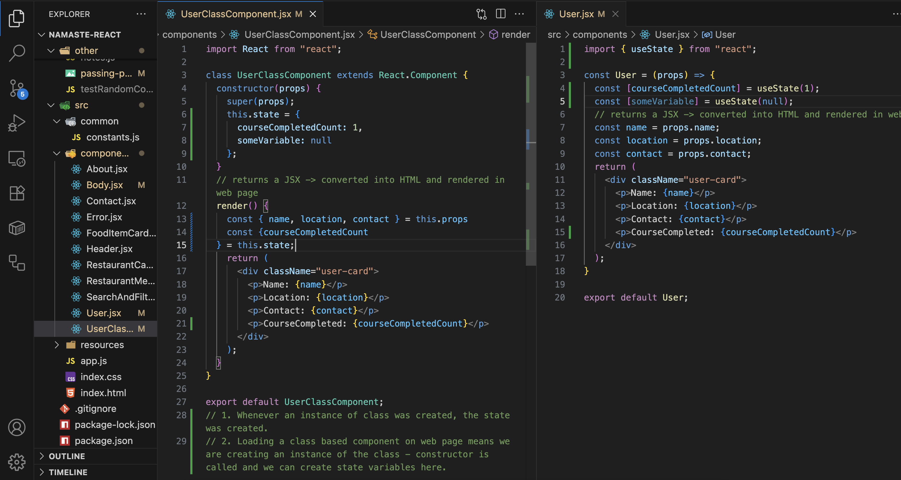

This codebase is for Namaste React course. Install CORS extension in your web browsers and check the project here 👉🏻 https://bhaskar123u.github.io/namaste-react/ 👈🏻

1. React element - Nothing but simple JS Object.

2. React.createElement('element', {k:'v'(html tag properties)}, ['childrens']); => Object and it becomes HTML which browser understands when we render it.

3. React.render replaces everything in the tag it is added, but html tree is made line by line, meaning all the element will be parsed line by line and when it sees .render( ), then it starts working -> order of files matter a lot.

4. React is a library, it can work inside a simple tag also. We don't need to create a full fledged app, react can be injected in a small portion of the app also.

5. If we want to create fast production ready app, react can't do it alone. We have other apps which helps react to do that.

6. NPM - It is not Node Package Manager 😂. In fact it is everything but not Node Package Manager. It is standard repository for a lot of packages. It uses package.json for managing versions of all packages/dependencies which are to be used in our app.

7. Parcel/Webpack/Vite - Bundlers. Bundles and packages the app so that it can be shiped to production. The 'create-react-app' command used webpack and babel behind the scenes to build things up. We are going to use parcel. This is installed as a dev dependency using 'npm install -D parcel'.

8. "^2.15.4" let's say this is the parcel version installed, now tomorrow 2.15.5 is realease, ^ -> installs the minor version automatically. ~ updates to next major version whichever is released.

9. package.json - keeps track of version installed for npm but package-lock.json - holds exact version that was used initially, it also holds all the version for all transitive dependency of all the packages which will be used. It keeps a hash to track version of local vs prod packages. Each dependency/project has it's own package.json which is used to download all transitive dependencies.

10. node_modules - fetch all actual code that will be used as a dependency. It is big in size don't put in github. All of node_modules can be created using package.json and package-lock.json. It's a collection of all dependencies.

11. npx parcel index.html - like npm, we have npx. Installing a package - npm ...
Executing a package - npx ...

12. using CDN for react is a costly operation - extra network call, instead install react locally as a package

13. We might get error as: Browser scripts cannot have imports and exports and points to this code <script src="./app.js"></script>. What this is telling that rn, the browser treats './app.js' as a simple js file. We have to tell it browser that is it a module.

14. Parcel - Dev(npx parcel index.html)/Prod(npx parcel build inde.html) Builds(in ./dist folder), Local Server, Hot Module Replacement(HMR - code changes automatically in server), it uses a file watching algorithms written in C++. It is using ./parcel-cache to load pages instantly giving faster builds. Image optimisation, Minification of files, Bundling, Compression, Code Splitting, Differential Bundling(support of older browsers), host app on HTTP && HTTPS, Tree Shaking Algorithms(remove unused code), Consistent Hashing.

15. We can write scripts in package.json to configure start command, from npx parcel index.html -> npm start

16. JSX - Javascript syntax to create React elements easily. It's hard to use React.createElement() for nested structures. It is not part of React, it is just a syntactical sugar.

17. Why react was built? - Markup in HTML, logic in JS, style in CSS. React tries to merge these things. All in same file.

18. HTML heading - `<h1 id='heading'>H1 in HTML</h1>`, React heading - React.createElement("h1",{id:'heading'},'H1 in React'), JSX heading - const heading = `<h1 id='heading'>H1 in JSX</h1>`

19. JSX != HTML inside javascript, it is HTML like syntax

20. Brower's JS Engine doesn't understand JSX, it understands only ECMA script. Whenever we write JSX, Parcel(Babel) converts it into valid JS. The code is transpiled before the code reaches JS Engine. How the conversion happens : check here - https://babeljs.io/ e.g., const heading = `<h1>sample h1 tag</h1>` -> const heading = `/*#__PURE__*/React.createElement("h1", null, "sample h1 tag")`

21. Babel is a transpiler, some browsers doesn't understand newer code, babel converts it into older format. Babel is a code converter and not only JSX, it handles a lot of things.

22. Use camelcase when giving properties in JSX tags e.g., in html `<h1 class='heading'>H1 tag</h1>` but in JSX we write
const heading = `<h1 className='heading'>H1 tag</h1>`.

23. Mutliple line JSX - wrap in ( ) for babel to understand the start and end point.
const heading = (`<h1 className='heading'>H1 tag</h1>`) not needed in single line but is needed in multiple lines JSX

24. React Component - Class Based, Function Based. Start with a CAPITAL LETTER. Functional Component(FC) is simply a JS fn which returns a JSX/React Element e.g., const FunctionalComponent = () => { return `<h1>H1 tag</h1>`; } OR const FunctionalComponent = function(){ return (`<h1>H1 tag</h1>`);};. We can also avoid 'return' keyword in arrow function syntax.

25. When we call a FC from another FC, it is called component composition.

26. In JSX whatever we write in {} is executed. We can execute JS code inside in it. JSX sanitise the data before using e.g., `<h1>{console.log(1+2);}</h1>` and prevents XSS attacks. We can add a react element in {} also.

27. If we want to give style in JSX, we have to give it like a JS Object for e.g., const styleCard = { color: '#f0f0f0' } and we can use it like return (`<div className='header' style={styleCard}></div>`). The same thing can be also done in this way `<div className='header' style={{ color: '#f0f0f0' }}></div>`.

28. In react we have props - something which we can pass to a component. Used to dynamically pass value to a component. Passing props to a component is same as passing an argument to a function. All props are passed as an object to the component.

29. Config Driven UI - Different UI for different user. It is data-driven.

30. When we loop over data and pass it in any component, make sure to have a key. Avoid index as keys if possible. Keys are very important as it tracks changes in DOM tree. If we don't have unique id for each data, we can use indexes as id.
Not using keys <<< index as keys <<< unique key.

31. We have 2 types of export/imports. 1. Default 2. Named.
1 -> export default Header; then import Header from "path";
2-> export const data; then import {data} from "path"; (when we have to multiple things from same file)

32. Whenever some data changes, let's say we have a list of objects which is powering some UI, now whenever that list changes, it won't update the UI, UNTIL THAT VARIABLE IS TRACKED BY REACT. Dom manipulation is powered by VIRTUAL DOM and diff algorithms. To do this react gives a way to declare a variable which is TRACKED BY REACT. We have to use a method called useState. It is a react hook. Hooks is nothing but a normal JS utility function. Most common ones are - useState, useEffect.

33. How do we create such variables - using useState. useState returns 2 things, react variable and a method to set that variable.
JS variable - const list = ['default_value'];
React state variable - const [list, setList] = useState(['default_value']); now to update the list we will call setList( ) function. Whenever the state variable will change, react RE-RENDERS the UI component where the state variable lives. When we use setList('some_value'), this doesn't change the same variable but it creates a new variable internally, hence the const nature of the variable is not voilated.

34. React uses reconciliation algorithm(React 16). It is also known as REACT FIBER. On UI let's say we have a DOM(tree), and the UI changes to filter some data which is supposed to update the UI. React creates a VIRTUAL DOM(internally it is a nested object, js representation of all html elements). It is a copy of actual DOM(tree). Now all the changes that happens, is tracked using old VIRTUAL DOM and new VIRTUAL DOM. As soon as something changes there is a delta between VIRTUAL DOMs. The difference is calculated and UI component is updated accordingly. Read here - https://github.com/acdlite/react-fiber-architecture

35. We should note that useState doesn't immediately changes data, let's say we want to build some filters using set method of useState, it is not always in sync. We can use useEffect hooks for that.

36. useEffect hook takes 2 arguments(callback fn, dependency array) - useEffect(()=> { console.log('callback fn is called');}, []). When the body component is loaded and the html is rendered, just after that the useEffect is called.
Body component loaded - UI is rendered - useEffect is called. The dependency array is not mandatory, in that case the useEffect will be called everytime the component renders. If the dependency array is empty [], useEffect is called only on initial render and just once. If we put something in dependency array, only if that changes, useEffect is called.

37. Whenever a state variable update, react re-renders the component. useEffect(()=> { console.log('callback fn is called');}, []), this will be printed only once after the initial render. But useEffect(()=> { console.log('callback fn is called');}, [some_variable]), this will be printed once after the initial render and then everytime some_variable changes. BEST PRACTICES - NEVER CREATE STATE VARIABLES outside of the component. Keep all state variables in top of the component. NEVER CREATE STATE VARIABLES in if-else code/for loops/functions, even though it can be done, but avoid it.

38. When we call a component like - `<Body />`, internally it will start executing all code, useState variables, then it will start rendering the JSX, meanwhile if it had encountered any useEffect code, it pushes that callback in a queue which is executed later.

39. CORS - Cross Origin Request. Our browsers don't allow to call external api from local host as they are 2 different source. This happens when the api server has 'Access-Control-Allow-Origin' in it's header. There is way we can get rid of that while development mode - use allow cors extension.

39. Shimmer - If we have a api call and based on tha data received, we are populating some UI, we should show shimmer for the time being the data is loaded. It will make UI/UX experience smooth as user sees a skeleton of page and then the actual page, making it a smooth experience.

40. Paths - We are using react-router dom for different paths. We have to create a configuration for paths and the pass it while rendering. We use createBrowserRouter to create routing config and then RouterProvider to provide this configuration to the main render method.

41. react-router-dom gives a hook - useRouterError which captures all error and help in displaying logical messages.

42. `<Outlet />` component is provided by react-router-dom, which is nothing but a placeholder. Based on routes it can be any component as mentioned in route config for e.g., `<Header /><Outlet />` can become `<Header /><Outlet />` when the path is "/", it can become `<Header /><About />` when the path is "/about".

43. Never use `<a>` tags for re-routing as it refreshes the whole page. It is still possible that the whole page is not reloaded still we get to see a new page UI. We can use `<Link>` for e.g., `<Link to="/">Home</Link>`. We can see in elements in inspect tabs. It's basically reloading a page vs refreshing the components. That is why react applications are known as SINGLE PAGE APPLICATION, just components interchanges. Traditionally we use to have different html pages for different screens like index.html, about-us.html and all these were tagged in `<a>` and when user clicked on them, it loaded the entire page.

44. We have 2 types of routing - Client Side Routing, Server Side Routing.
SERVER SIDE ROUTING - User clicked on About Us page, then browsers make a call to server, fetches the html, css files and loads the page. CLIENT SIDE ROUTING - No network calls is made, all the components are already loaded code for all component in the start and it's just the component gets added according to the path.

45. Dynamic Routing - We can create dynamic routing using react-router-dom for e.g., path: "/restaurant/:resId" and the component on which we click and get can be added as 
`<Link to={/restaurant/${res.info.id}} className='card-link' key={res.info.id}> <RestaurantCard props={res.info} /> </Link>`. For complete syntax look into Body.jsx

46. Class Based Components - Just a class with render method. The render method returns JSX.




As soon as the JSX stars rendering and react sees that a class based component is called, it immediately starts loading/instantiating it and then constructor() is called followed by render().

47. We can declare state variables in constructor for e.g.,
```javascript
constructor(props) {
    super(props);
    this.state = {
      courseCompletedCount: 1,
    };
}
```
If you write super(props), React passes the props up to the React.Component constructor, then this.props is set up properly inside your component.

48. We can set state using this.setState() for e.g., assuming courseCompletedCount is a state variable inside constructor
```javascript
this.setState({
    courseCompletedCount: this.state.courseCompletedCount + 1
});
```
The component is re-rendered and UI is updated. The state variable(this.state) is a big object, this.setState only updates what is needed, other variables are not updated. When setState() is called, the updating part of react life cycle starts.

49. Life cycle of class based component - constructor -> render(DOM update) -> componentDidMount
Condition 1 : Parent(Child)
Parent constructor
Parent render
  Child constructor
  Child render
  Child ComponentDidMount
Parent ComponentDidMount

Condition 2 : Parent(Child1, Child2) -> here 2 different instances of Child are created
Parent constructor
Parent render
  Child1 constructor
  Child1 render
  Child2 constructor
  Child2 render
  // react will batch render phases for all children for optimisation, before calling ComponentDidMount
  // everything in render phase happens at VDOM (nothing but JS Object) level that is very passed
  ------- DOM MANIPULATION STARTS -------
  Child1 ComponentDidMount
  Child2 ComponentDidMount
  // react will batch commit phases for all children for optimisation, as DOM manipulation is the most expensive
  // thing while updating a component
Parent ComponentDidMount

Let's say we are updating something on UI

constructor -> render(DOM update) -> componentDidMount(only called once) -> if setState() is called -> render(DOM update) -> componentDidUpdate -> componentUnmount

First mount cycle -> update cycle -> unmount cycle(when component is removed from UI)

Refer - https://projects.wojtekmaj.pl/react-lifecycle-methods-diagram/


render phase - constructor, render
commit - actual update of DOM

50. Use of componentDidMount - to make api calls, let the component load with basic details(all html tags), react can make quick re-rendering so once we have the component ready we can fill the data. No need to wait for the api to send data. So basically useEffect(() => {}) is equivalent to componentDidMount and useEffect(() => {},[]) is equivalent to componentDidUpdate.

51. Let's say we have a setInterval(()=>{console.log('India')},1000); which is printing India in console after every 1 second and this is added in componentDidMount. Now even if we goto different page, this interval will still be alive and let's say this interval was added in "/about" page component, it will still be active if we visit "/contact" and everytime we will visit "/about", an extra interval will be started 😂 - all of this happens because of SPA, now it's a single page, no reloading of page as we are not using `<a>` tag now. If left unchecked, all these can blow the code. All of this can be cleared in ComponentWillUnmount. The same behavior will be seen if we write like below
```javascript
useEffect(()=>{
  setInterval(()=>{
    console.log('India');
  },1000);
},[]);
// To tackle this, we can return a function from useEffect() and it is called when we are unmounting the component like below
useEffect(()=>{
  setInterval(()=>{
    console.log('India');
  },1000);

  return ()=>{
    // runs when component unmounts
  };
},[]);
```

52. Why can't we use async in useEffect like
```javascript
useEffect(async ()=>{
  // ERROR
},[]);
```
useEffect expects your callback to either return nothing or return a cleanup function.
But if you mark it async, the function always returns a Promise, and React doesn’t know what to do with that. Correct way is to use async logic inside a function
```javascript
useEffect(() => {
  async function fetchData() {
    const resp = await fetch("/api/data");
    const json = await resp.json();
    console.log(json);
  }

  fetchData();
}, []);

// OR use a IIFE
useEffect(() => {
  (async () => {
    const resp = await fetch("/api/data");
    const json = await resp.json();
    console.log(json);
  })();
}, []);
```

53. Custom Hooks - Hooks are nothing but a utility function. If the function starts with 'use...', react sees it as a hook. First try to finalise the input and output of the hook.

54. If all of our js file is bundled into a single .js file, it will be huge in size(can be seen in network tab). So we make smaller bundles and this is known as CHUNKING / CODE-SPLITTING / DYNAMIC BUNDLING / LAZY LOADING. But keep in mind that a bundle should have enough code for a feature as well as maintaining the file size, it should not be so heavy that browsers take a lot of time to load them.

55. Now when we click on InstaMart from header and checks the network tab, we see that a different js file loads for Instamart. Note that this file has all code for instamart verticle and is different from main vertical. All this is done because we are loading the component in a lazy way.

56. Sometimes what happens it when we click on Instamart, the code for instamart starts loading, meanwhile react tries to render the component and it finds the code to be not present. At that point is suspends the loading and throws error. We can use 'Suspense' component for that.

57. Tailwindcss - Parcel needs postcss to read and understand tailwindcss. We can apply mutiple classes as follow - `<button className={px-4 py-2 rounded ${isPrimary ? "bg-blue-500 text-white" : "bg-gray-200 text-black"}}>Click me</button>`

58. Higher Order Function - A component that takes a component as input, enhances it and returns it back for e.g.,
```javascript
const HigherOrderFunction = (Component) => {
  // returns another component which is nothing but a function
  return () => {
    // todo on Component
  }
};
```
A HOC must be called with a component to produce an enhanced component, then you render that enhanced component.
const NewHOCComponent = HigherOrderFunction(OldComponent);

You don't render HOC component directly. `<HigherOrderFunction />` -> NOT TO BE DONE.

We can do N number of things in HOC such as changing css styles and all sorts of cross cutting concerns. HOC doesn't mutate old component. HOC returns a new React component (NewComponent) that new component may wrap, replace, or conditionally render WrappedComponent. HOCs generalize conditional rendering (and more) so that logic is reusable and not tied to a single component. If the condition is specific to that component (e.g., “Show veg-only filter if restaurant supports it”), do conditional rendering inside. If the condition is cross-cutting (e.g., “Show skeleton while fetching,” “Protect route if user not logged in”), use a HOC (or hook).

59. The “new component” can:
1. Wrap the old one in extra elements:
  `<div className="wrapper"> <WrappedComponent {...props} /> </div>`
2. Decide when to render it:
  {props.show && `<WrappedComponent {...props} />`}
3. Pass new or modified props down:
  `<WrappedComponent {...props} theme="dark" />`
But the inner component’s structure is preserved unless the HOC deliberately changes the props or styling. We can inject className or complete style itself from HOC and it will be applied at Child component level.

60. React Dev Tools(Chrome extension) - Explore Profiler and Components

61. State Lifting - State = data you keep in a component using useState e.g., const [count, setCount] = useState(0);.Sometimes two or more child components need to use the same piece of data. Instead of keeping that state separately in each child, you “lift” it up into their common parent, so both children can share it.

62. Controlled component && Uncontrolled component - Component which rely on their parent for any state are called uncontrolled component. Example - Let's say we have 5 accordion which expands and collapse. Now expanding any item might collapse another, let's say we have Accordion 1, A2, A3, A4, A5. Now assume A2 is expanded. User expands A3, this leads to A2 being collapse. Each of these accordion won't know the state of another, so as to modify their own state. Hence we keep the state at parent level, which passes all these data to children.

63. We have to manage the state variable at parent level from children. Let's say we have a showIndex variable at parent level and using this variable the accordion is expanded. If the showIndex = 0, A1 is expanded and rest all are collapsed. Now assume A2 is expanded right now, and user clicks on A3, so showIndex at parent level should become 3. We have to update the state variable declared in parent component from childrens -> This can be done by passing the setShowIndex() function from parent to child as follow `<ChildComponent setShowIndex={() => setShowIndex(index)}>` assuming setShowIndex(index) is called in child within some eventHandler.
Read here - https://react.dev/learn/sharing-state-between-components#lifting-state-up-by-example

64. Props drilling - Data flows one way e.g., grandparent component - parent1 component - child1 component
all of these will be passed in similar order as - `<ParentComponent dummy={dummy}>`, similarly it will be passed along. But this is not ideal way, if we want to send data from top hierarchy to deep down(say 10 levels), it might take a lot of code. SOLUTION - useContext() : Consider it as a global object that is accessible at any level at any layer. Let's say we are building dark/light theme button, that theme information we can put in context and it can be picked from there before loading every page, we can apply that.

65. const UserContext = createContext(); This UserContext object has two important properties:
UserContext.Provider → used to provide values
UserContext.Consumer → used to consume values (older way, before hooks)
If you don’t assign it to a variable (UserContext here), you’d lose the reference and couldn’t use it later. In functional component, we use useContext() hook to read data e.g., assuming we are exporting the context data from MyContext.js as
```javascript
import { createContext } from "react";
export default createContext({
    firstName: "Bhaskar"
});
```
Now we have to read that data as follow, assuming we have imported the MyContext
```javascript
const contextData = useContext(MyContext);
const firstName = contextData?.firstName;
```
In class based component we don't have hooks so there is a different way to read context data - `<div><UserContext.Consumer> {(data) => console.log(data)} </UserContext.Consumer></div>`, this data is the context data. So there are two ways to read context data.

66. Write new data in context - ContextProvider e.g.,
```javascript
export default UserContext = createContext({});
```
This will be used as follows
`<UserContext.Provider value={{some_data}}> any component/HTML tag wrapped here will have this access to some_data </UserContext.Provider>`
We can use provider for a specific section also, we can create multiple context. So eventually if the component or any HTML structure is not wrapped inside Provider, it will use the default value. Else if it is wrapped in some specific provider, new value will be used.

67. useNavigate(), useParams() are hooks from react-router-dom, that gives you a different functionalities. Using useNavigate() you can call to imperatively change the URL (navigate) in your code.

68. Zustand/Redux - Libraries to manage state.

69. Why use redux - For large scale applications, redux provide lot of features for state management. Read here - https://redux.js.org/tutorials/essentials/part-1-overview-concepts

70. React Redux - Bridge between react and redux(https://react-redux.js.org/tutorials/quick-start). Redux Toolkit(RTK) - Newer way of writing redux(https://redux-toolkit.js.org/tutorials/overview).

71. Redux store - A very big JS Object located at a central place, this will be accessed by any component. Redux store have slices for better partitioning of redux store (User slice, Cart slice, Theme slice etc). Now let's say we have add button on each item, when clicked we should add that food item in Cart but we cannot do it directly.
WHEN WE CLICK ON ADD BUTTON, IT DISPATCHES AN ACTION, IT CALLS A FUNCTION which will modify the appropriate slice(cart slice in this case). THIS FUNCTION IS CALLED REDUCER.


72. Read Redux Data - We use SELECTOR(hook). Selector reads data from store and modify the react component. This is called subscribing to the store. It is in sync with store, if the data in store changes, the component data changes.


73. Final Redux - 

74. onClick = { addItem } VS onClick = { () => addItem(item) } VS onClick = { addItem(item) }

  1. onClick={addItem}
  Here you’re passing the function reference. React will call addItem(event) when the click happens, and the click event object will be passed automatically. Correct when your handler doesn’t need extra arguments.

  2. onClick={() => addItem(item)}
  Here you’re passing an arrow function. React calls the arrow on click, and inside that you call addItem(item). Correct when you want to pass custom data (like item) instead of the default click event.

  3. onClick={addItem(item)}
  ❌ This is wrong in most cases. Why? Because it calls addItem(item) immediately during render, not a callback when the click happens. The result of that function call (likely undefined) is what React assigns to onClick. So the handler runs on render and not on click → bug.

  Analogy
  Think of onClick={...} as “what should React do later when clicked”. onClick={addItem} → “when clicked, call addItem with the event”. onClick={() => addItem(item)} → “when clicked, run this arrow, which will call addItem with my custom argument”. onClick={addItem(item)} → “call addItem(item) right now, and whatever it returns will be used later” → usually not what you want.

  ✅ Rule of thumb
  No args needed → onClick={handler}. Args needed → onClick={() => handler(arg)}

75. Be careful while subscribing to the redux store.
```javascript
const cart = useSelector((store) => store.cart)
```
Avoid this as we have subscribed to the whole cart store, everytime anything in this store changes, the whole component re-renders. Instead do a specific subscription such as
```javascript
const cartItems = useSelector((store) => store.cart.items);
```
Now let's say we have to show cart total, everytime something is added/subtracted, the cart total changes. Hence we would need to re-calculate. One way is that we have to write calculation logic inline but there is a better way, Solution - memoized selector. In a separate file we can write the following code
```javascript
import { createSelector } from "@reduxjs/toolkit";
export const selectCartItems = (state) => state.cart.items;

export const selectCartTotal = createSelector(
  [selectCartItems],
  (items) => items.reduce((sum, item) => sum + item.price * item.qty, 0)
);
```
and then use it as follow
```javascript
import { useSelector } from "react-redux";
import { selectCartTotal } from "./selectors";

const CartSummary = () => {
  const total = useSelector(selectCartTotal);

  return (
    <div>
      <p>Total: ${total}</p>
    </div>
  );
};
```

76. Redux uses Immer library to find the difference between previous and new state and helps maintain immutability of state. Read - https://redux-toolkit.js.org/usage/immer-reducers, https://immerjs.github.io/immer/


77. Read - Redux Thunk and RTK Query (https://redux-toolkit.js.org/rtk-query/overview)